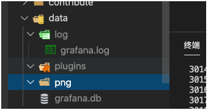

# grafana开源贡献指南

## 开发

* 安装依赖包

  ```shell
  # 如果之前安装的一些包冲突可以用  yarn cache clean 来清除所有缓存
  > yarn install --pure-lockfile  #不更新yarn.lock 暗转依赖包
  ```

* 启动前端服务

  ```shell
  > yarn start 
  ```

* 启动后端服务

  ```shell
  # cd 到项目的跟目录
  # 这里会用go启动一个后端的服务，并在【data】目录下 会生成对应的一些静态文件和数据库文件
  > make run 
  ```

* 启动后生成的目录

  * data

    * log 
      * grafana.log (存储api接口的日志)
    * plugins
      * 存储各种外部的插件
    * png
      * 存储上传的图片
    * grafana.db
      * 存储账号/密码
      * 存储一些图表的名字和结构

    

  

* 访问http://localhost:3000 ，你就可以访问grafana的服务了，默认账号和密码是：`admin` 和  `admin`

## 打包

* 编译打包后端 + 前端

  ```shell
  go run build.go build package
  ```

  